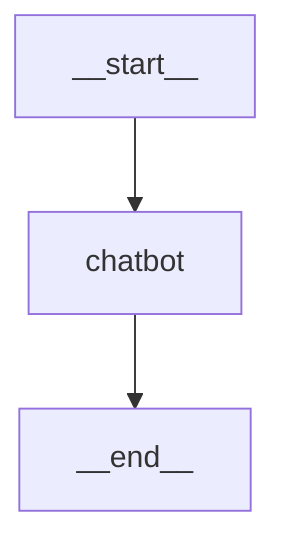

[url](https://langchain-ai.github.io/langgraph/tutorials/get-started/1-build-basic-chatbot/)

### **LangGraph: 기본 챗봇 만들기 튜토리얼**

이 튜토리얼에서는 기본적인 챗봇을 만들어 봅니다. 이 챗봇은 앞으로 이어질 튜토리얼 시리즈의 기초가 되며, 여기에 점차 더 정교한 기능들을 추가하면서 LangGraph의 핵심 개념들을 배우게 될 것입니다. 함께 시작해볼까요\!

-----

### **사전 준비 사항**

이 튜토리얼을 시작하기 전에, OpenAI, Anthropic, 또는 Google Gemini와 같이 **도구 호출(tool-calling) 기능**을 지원하는 LLM에 접근할 수 있어야 합니다.

> **💡 쉽게 이해하기: 도구 호출(Tool-Calling)이란?**
>
> LLM이 단순히 대화만 하는 것을 넘어, 필요할 때 **미리 정의된 함수나 외부 API 같은 '도구'를 스스로 호출해서 사용하는 기능**을 말합니다. 예를 들어, "오늘 서울 날씨 어때?" 라는 질문에 LLM이 '날씨 조회'라는 도구(함수)를 직접 실행해서 그 결과를 바탕으로 답변하는 것이죠. 챗봇에게 초능력을 달아주는 것과 같습니다.

-----

### **1. 패키지 설치하기**

필요한 패키지들을 설치합니다.

```bash
pip install -U langgraph langsmith
```

> **팁 💡**
> [LangSmith](https://smith.langchain.com/)에 가입하면 LangGraph 프로젝트의 문제를 빠르게 찾아내고 성능을 개선할 수 있습니다. LangSmith는 추적 데이터(trace data)를 사용해 LLM 앱을 디버깅, 테스트, 모니터링하는 것을 도와줍니다.

-----

### **2. `StateGraph` 생성하기**

이제 LangGraph를 사용해 기본 챗봇을 만들어 봅시다. 이 챗봇은 사용자의 메시지에 직접 응답할 것입니다.

먼저 `StateGraph` 객체를 생성합니다. `StateGraph` 객체는 우리 챗봇의 구조를 "상태 머신(state machine)" 으로 정의합니다. 여기에 챗봇이 호출할 LLM이나 함수를 나타내는 `노드(nodes)` 를 추가하고, 챗봇이 이 함수들 사이를 어떻게 이동할지 지정하는 `엣지(edges)` 를 추가할 것입니다.

```python
from typing import Annotated
from typing_extensions import TypedDict
from langgraph.graph import StateGraph, START, END
from langgraph.graph.message import add_messages

# State 클래스는 그래프의 '상태'가 어떤 구조를 가질지 정의합니다.
class State(TypedDict):
    # 'messages'라는 키는 리스트 형태의 메시지들을 담습니다.
    # Annotated 안에 있는 add_messages 함수는 이 상태 값이 어떻게 업데이트될지 정의합니다.
    # (이 경우, 기존 메시지를 덮어쓰는 대신 리스트에 새로운 메시지를 추가합니다.)
    messages: Annotated[list, add_messages]

# State 클래스를 기반으로 그래프 빌더(설계도)를 생성합니다.
graph_builder = StateGraph(State)
```

이제 우리 그래프는 두 가지 핵심 작업을 처리할 수 있습니다.

1.  각 **노드**는 현재 \*\*`State`\*\*를 입력으로 받아, 상태를 업데이트하는 내용을 출력할 수 있습니다.
2.  `Annotated` 구문과 함께 사용된 `add_messages` 내장 함수 덕분에, \*\*`messages`\*\*에 대한 업데이트는 기존 리스트를 덮어쓰는 대신 새로운 메시지를 **추가**하게 됩니다.

>  **💡 쉽게 이해하기: `State`와 `add_messages`**
>
>   * **`State`**: 그래프 전체에서 공유되는 **'데이터 상자'** 또는 \*\*'메모리'\*\*라고 생각하세요. 챗봇이 작업을 처리하는 동안 필요한 모든 정보(예: 대화 기록)를 이 상자에 담아둡니다. `TypedDict`는 이 상자에 어떤 종류의 데이터를 담을지(예: `messages`는 리스트 형태) 미리 정해두는 약속입니다.
>   * **`Annotated[list, add_messages]`**: 이것은 `messages` 데이터에 대한 특별한 규칙입니다. 그냥 `list`라고만 쓰면 새로운 메시지가 생길 때마다 기존 대화 기록을 지우고 새로 씁니다. 하지만 `add_messages`를 함께 써주면, "기존 대화 기록은 그대로 두고, 맨 뒤에 새 메시지를 추가해줘\!" 라는 의미가 됩니다. 덕분에 대화가 계속 쌓일 수 있습니다.

-----

### **3. 노드 추가하기**

다음으로, "chatbot" 노드를 추가합니다. **노드**는 작업의 단위를 나타내며, 보통 일반적인 파이썬 함수로 만듭니다.

#### 1. 패키지 설치

먼저 Gemini 연동에 필요한 `langchain-google-genai`와 `.env` 파일을 읽기 위한 `python-dotenv` 패키지를 설치합니다.

```bash
pip install -U langchain-google-genai python-dotenv
```

#### 2. .env 파일 생성 및 API 키 저장

프로젝트의 최상위 경로에 `.env` 라는 파일을 만들고, 그 안에 발급받은 Gemini API 키를 저장합니다. Google AI Studio에서 API 키를 발급받을 수 있습니다.

**`.env`**
```
# .env 파일 내용
GOOGLE_API_KEY="YOUR_GEMINI_API_KEY"
```

**주의**: `YOUR_GEMINI_API_KEY` 부분에 실제 본인의 API 키를 붙여넣으세요. `.env` 파일은 `.gitignore`에 추가하여 Git 저장소에 올라가지 않도록 관리하는 것이 좋습니다.

#### 3. Python 코드 수정

이제 Python 코드에서 `dotenv`를 이용해 API 키를 불러오고 `ChatGoogleGenerativeAI`를 사용하도록 수정합니다.

```python
import os
from dotenv import load_dotenv
from langchain_google_genai import ChatGoogleGenerativeAI

# .env 파일에서 환경 변수를 불러옵니다.
load_dotenv()

# ChatGoogleGenerativeAI를 초기화합니다.
# API 키는 load_dotenv()를 통해 자동으로 환경 변수에서 읽어옵니다.
llm = ChatGoogleGenerativeAI(model="gemini-1.5-flash-latest")

# --- 사용 예시 ---
# response = llm.invoke("인공지능의 미래에 대해 한 문장으로 요약해줘.")
# print(response.content)
```

이제 코드를 실행하면 `load_dotenv()`가 `.env` 파일을 읽어 `GOOGLE_API_KEY`를 환경 변수로 설정해주기 때문에, 코드에 직접 API 키를 노출하지 않고도 안전하게 Gemini 모델을 사용할 수 있습니다.

이제 이 채팅 모델을 간단한 노드 안에 포함시킬 수 있습니다.

```python
def chatbot(state: State):
    # 현재 상태(state)에 있는 메시지들을 llm에 넘겨주고, 응답을 받습니다.
    return {"messages": [llm.invoke(state["messages"])]}

# 그래프 빌더에 'chatbot'이라는 이름으로 노드를 추가합니다.
# 첫 번째 인자는 노드의 고유한 이름입니다.
# 두 번째 인자는 이 노드가 호출될 때 실행될 함수입니다.
graph_builder.add_node("chatbot", chatbot)
```

`chatbot` 노드 함수가 현재 `State`를 입력으로 받고, "messages"라는 키 아래에 업데이트된 메시지 리스트를 담은 딕셔너리를 반환하는 것을 주목하세요. 이것이 모든 LangGraph 노드 함수의 기본 패턴입니다.

`State`에 정의한 `add_messages` 함수가 LLM의 응답 메시지를 현재 상태에 이미 있는 메시지들에 추가해 줄 것입니다.

-----

### **4. 진입점(Entry Point) 추가하기**

그래프가 실행될 때마다 **어디서 작업을 시작해야 하는지** 알려주는 진입점을 추가합니다.

```python
graph_builder.add_edge(START, "chatbot")
```

`START`는 "시작"을 의미하는 특별한 키워드입니다. 이 코드는 "그래프가 시작되면, 무조건 'chatbot' 노드부터 실행해"라는 의미입니다.

-----

### **5. 종료점(Exit Point) 추가하기**

그래프가 **어디서 실행을 마쳐야 하는지**를 나타내는 종료점을 추가합니다. 이것은 더 복잡한 흐름에서 유용하지만, 이처럼 간단한 그래프에서도 종료 노드를 추가하면 흐름이 더 명확해집니다.

```python
graph_builder.add_edge("chatbot", END)
```

`END`는 "끝"을 의미하는 특별한 키워드입니다. 이 코드는 "'chatbot' 노드가 실행된 후에는 그래프를 종료해"라는 의미입니다.

-----

### **6. 그래프 컴파일하기**

그래프를 실행하기 전에, 컴파일해야 합니다. `graph_builder`에서 `compile()`을 호출하여 이 작업을 수행할 수 있습니다. 이렇게 하면 우리가 상태에 대해 호출할 수 있는 `CompiledStateGraph`가 생성됩니다.

```python
graph = graph_builder.compile()
```

>  **💡 쉽게 이해하기: 컴파일(Compile)이란?**
>
> 지금까지 `graph_builder`로 만든 것은 챗봇의 \*\*'설계도'\*\*입니다. `compile()`은 이 설계도를 실제로 실행할 수 있는 **'실행 파일'** 또는 \*\*'애플리케이션'\*\*으로 만드는 과정이라고 생각하면 됩니다.

-----

### **7. 그래프 시각화하기 (선택 사항)**

`get_graph()` 메소드와 `draw_mermaid_png()` 같은 그리기 메소드 중 하나를 사용하여 그래프를 시각화할 수 있습니다.

```python
from IPython.display import Image, display

try:
    # 그래프의 구조를 이미지로 그려서 보여줍니다.
    display(Image(graph.get_graph().draw_mermaid_png()))
except Exception:
    # 이 기능은 추가 패키지 설치가 필요하며, 선택 사항입니다.
    pass
```

**(결과 이미지)**



* `__start__` (시작)에서 `chatbot` 노드로 화살표가 이어지고,
* `chatbot` 노드에서 `__end__` (끝)으로 화살표가 이어지는 단순한 구조를 볼 수 있습니다.

-----

### **8. 챗봇 실행하기**

이제 챗봇을 실행해 봅시다\!

> **팁 💡**
> 채팅 루프는 언제든지 `quit`, `exit`, 또는 `q`를 입력하여 종료할 수 있습니다.

```python
while True:
    user_input = input("User: ")
    if user_input.lower() in ["quit", "exit", "q"]:
        print("Goodbye!")
        break
    # 사용자의 입력을 포함하여 그래프를 스트리밍 방식으로 실행합니다.
    for event in graph.stream({"messages": [{"role": "user", "content": user_input}]}):
        for value in event.values():
            # LLM이 생성하는 답변의 마지막 부분을 실시간으로 출력합니다.
            print("Assistant:", value["messages"][-1].content)
```

**실행 결과 예시:**

```
User: LangGraph에 대해 아는 거 있어?
Assistant: LangGraph는 상태를 가진(stateful) 다중 에이전트 애플리케이션을 언어 모델을 사용하여 구축하는 데 도움을 주기 위해 설계된 라이브러리입니다. 여러 AI 에이전트나 언어 모델의 상호작용을 조율하기 위한 워크플로우와 상태 머신을 만드는 도구를 제공합니다. LangGraph는 LangChain을 기반으로 만들어졌으며, LangChain의 구성 요소를 활용하면서 그래프 기반의 조율 기능을 추가합니다. 단순한 질의-응답 상호작용을 넘어서는 더 복잡하고 상태를 기억하는 AI 애플리케이션을 개발하는 데 특히 유용합니다.
User: quit
Goodbye!
```

**축하합니다\!** LangGraph를 사용하여 첫 챗봇을 만들었습니다. 이 봇은 사용자 입력을 받아 LLM을 사용하여 응답을 생성함으로써 기본적인 대화를 나눌 수 있습니다.

-----

### **다음 단계**

봇의 지식이 훈련 데이터에 있는 내용으로 제한된다는 것을 눈치채셨을 겁니다. 다음 파트에서는 **웹 검색 도구를 추가**하여 봇의 지식을 확장하고 더 유능하게 만들어 보겠습니다.