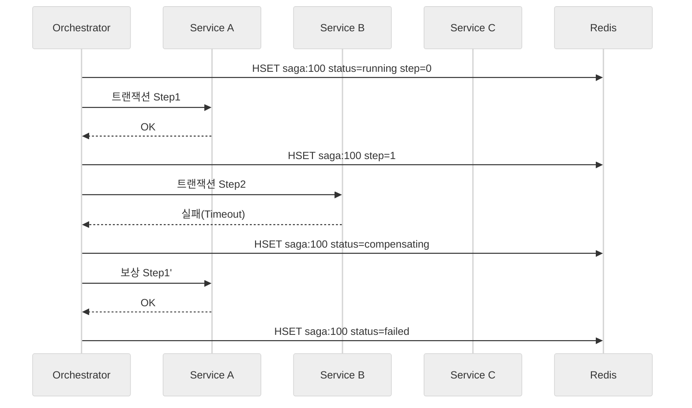

# Redis에서의 Saga Pattern

## 개요

분산 시스템에서 하나의 비즈니스 트랜잭션이 여러 마이크로서비스나 저장소에 걸쳐 있을 때, 단일 트랜잭션(2PC 등)으로 묶기 어렵다면 **Saga Pattern**을 사용해 일련의 로컬 트랜잭션과 보상(Compensation) 로직으로 일관성을 맞춥니다. Redis는 빠른 상태 저장소이자 메시징 도구로 사용하기 쉬워, Saga의 진행 상태를 기록하거나 보상 작업을 예약하는 데 자주 활용됩니다.

### 핵심 아이디어

- 각 단계는 **로컬 트랜잭션**이며 성공 시 다음 단계로 진행합니다.
- 실패 시 지금까지 수행한 단계에 대응하는 **보상 트랜잭션**을 실행해 시스템을 이전 일관된 상태로 되돌립니다.
- 중앙에서 순서를 제어하는 **오케스트레이션(Orchestration)** 과 이벤트 기반으로 흐름을 이어가는 **코레오그래피(Choreography)** 두 가지 접근 방식이 있습니다.
- Redis는 고속 읽기/쓰기가 가능하고 TTL, Lua, Streams 등 다양한 기능을 제공하므로 Saga 상태 추적, 이벤트 로그, 타임아웃 관리에 유용합니다.

---

## Redis를 활용한 Saga 구성 요소

| 역할 | Redis 자료구조 | 활용 방법 |
| --- | --- | --- |
| Saga 실행 상태 저장 | `HASH`, `JSON`, `HSET` | 현재 스텝, 보상 필요 여부, 타임스탬프 등을 저장 |
| 단계별 이벤트 로그 | `STREAMS`, `LIST` | 다음 단계로 전달할 데이터, 재시도용 페이로드 보관 |
| 타임아웃/재시도 관리 | `ZSET`, `SETEX` | 만료 시간이 다가오면 보상 트랜잭션 실행 트리거 |
| 락/동시성 제어 | `SET NX PX`, RedLock | 중복 실행 방지, 멱등성 보장 보조 |

---

## 오케스트레이션 접근

중앙 컨트롤러(예: `saga-orchestrator` 서비스)가 Redis에 상태를 기록하고 다음 스텝을 호출합니다.

### 플로우 예시

1. Orchestrator가 `HSET saga:{id}` 로 초기 상태를 저장.
2. 각 단계 서비스에 HTTP/RPC 호출. 성공 시 `HINCRBY` 로 스텝 업데이트.
3. 실패하면 Orchestrator가 보상 단계 목록을 역순으로 실행.
4. 모든 단계가 종료되면 `DEL saga:{id}` 또는 완료 상태 기록.



### Redis에 기록하는 데이터 예시

```bash
HSET saga:order:123 status running current_step 1 payload '{"order_id":123}'
LPUSH saga:order:123:log '{"event":"step1_done","ts":1700000000}'
ZADD saga:timeouts 1700000300 saga:order:123
```

`ZADD` 로 타임아웃을 관리하면 워커가 주기적으로 `ZRANGEBYSCORE` 를 호출해 만료된 Saga를 찾아 보상 로직을 실행할 수 있습니다.

---

## 코레오그래피 접근

각 서비스가 특정 이벤트를 구독하고, 자신의 단계가 끝나면 다음 이벤트를 발행합니다. 중앙 제어 없이 느슨하게 연결됩니다.

### Redis Streams 기반 예시

```python
from redis import Redis
r = Redis(...)

# 주문 생성 서비스
r.xadd("saga:order_stream", {
    "saga_id": "order:123",
    "event": "OrderCreated",
    "payload": '{"order_id":123}'
})

# 결제 서비스 소비자 그룹
group = "payment"
r.xgroup_create("saga:order_stream", group, id="0-0", mkstream=True)

while True:
    entries = r.xreadgroup(group, "worker-1", {"saga:order_stream": ">"}, count=1, block=5000)
    for stream, messages in entries:
        for message_id, fields in messages:
            # 트랜잭션 수행 후 결과 이벤트 발행
            r.xadd("saga:order_stream", {
                "saga_id": fields["saga_id"],
                "event": "PaymentReserved",
                "payload": '{"order_id":123}'
            })
            r.xack(stream, group, message_id)
```

코레오그래피 방식에서는 각 서비스가 동일한 Redis Stream을 참조해 상태를 공유합니다. 실패 시 보상 이벤트(`PaymentCancelRequested`) 같은 형태로 다시 발행해 이전 단계의 서비스를 트리거합니다.

---

## 보상(Compensation) 전략

1. **정방향 단계와 동일한 저장소 사용**  
   Redis에 기록한 값을 삭제하거나 이전 값으로 되돌립니다. 예: `INCR` 했던 재고를 `DECR` 로 원복.

2. **이벤트 기반 보상**  
   보상 이벤트를 `STREAM`/`PUBSUB` 로 발행하여 해당 서비스가 비동기적으로 처리하도록 합니다.

3. **보상 데이터 스냅샷 유지**  
   각 단계 실행 전 `HGETALL` 로 스냅샷을 저장하거나 `JSON.DUMP` 로 직렬화해 두고, 보상 단계에서 복원합니다.

4. **멱등성(Idempotency)**  
   보상 작업이 중복 실행되어도 동일한 결과가 되도록 `SETNX` 키나 `SADD` 로 이미 실행한 보상 ID를 기록합니다.

---

## 설계 시 고려사항

- **데이터 일관성 수준**: Saga는 결국 최종적 일관성(Eventual Consistency)을 제공합니다. 사용자 경험상 허용 가능한 지연을 정의해야 합니다.
- **락과 조합**: 동일 리소스를 동시에 수정하는 경쟁 상황에서는 Redis 락(RedLock 등)을 병행해 중복 실행을 막습니다.
- **타임아웃 관리**: Orchestrator 또는 워커가 주기적으로 `ZSET` 기반 타임아웃 큐를 확인하여 장시간 정체된 Saga를 정리합니다.
- **모니터링**: Redis에 저장된 상태(`HGET`, `XLEN`)와 실패/보상 카운트를 대시보드로 노출합니다.
- **복구 플랜**: 보상 단계가 반복 실패할 때 수작업介入이 가능하도록 관리자용 인터페이스를 준비합니다.

---

## Redis Saga 패턴 체크리스트

- [ ] 각 단계와 보상 단계가 멱등성을 보장하는가?
- [ ] Saga 상태가 Redis에 영속화되어 재시작 후에도 이어서 처리 가능한가?
- [ ] 타임아웃, 재시도, 장애 시 알람 체계가 마련되어 있는가?
- [ ] 보상 단계가 실패했을 때 대체 시나리오가 정의되어 있는가?
- [ ] 테스트 환경에서 의도적으로 실패를 주입해 보상 로직을 검증했는가?

---

## 참고 자료

- Redis Streams를 이용한 분산 트랜잭션 처리 패턴
- Martin Fowler, *Saga Pattern* (https://martinfowler.com/articles/sagas.html)
- Redis Labs, *Managing Transactions and Rollbacks in Microservices*
